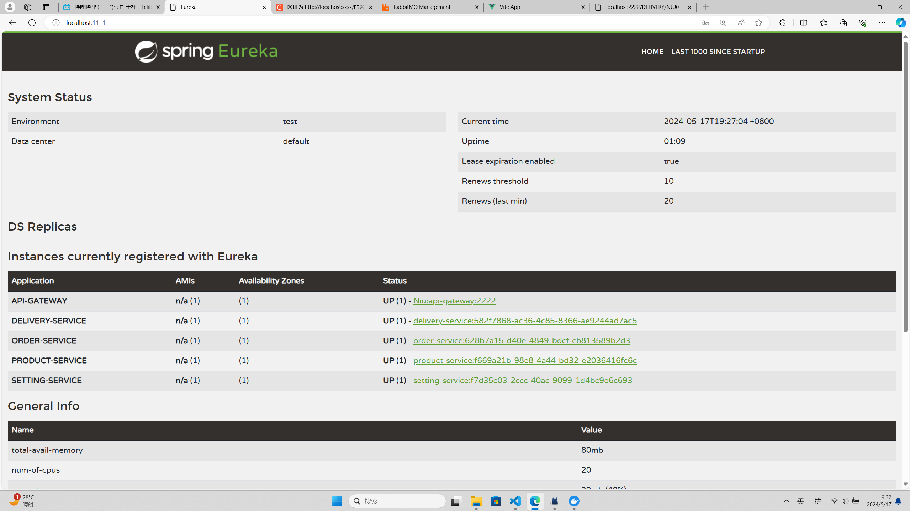
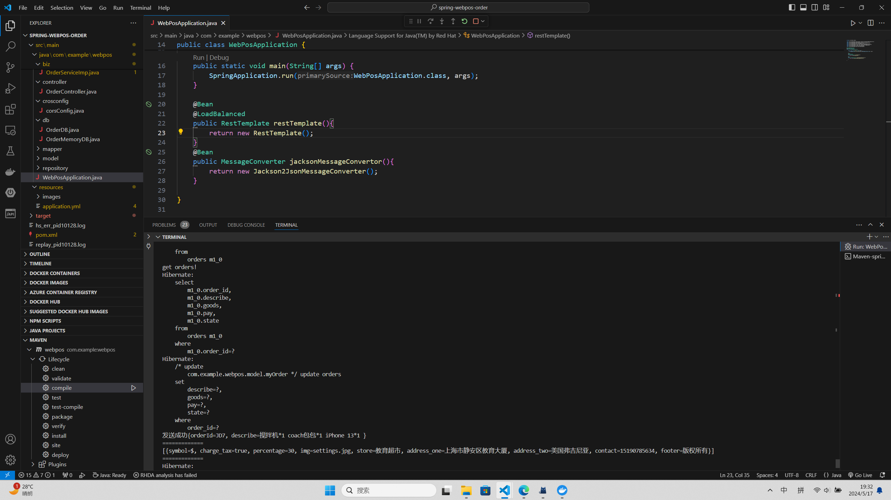
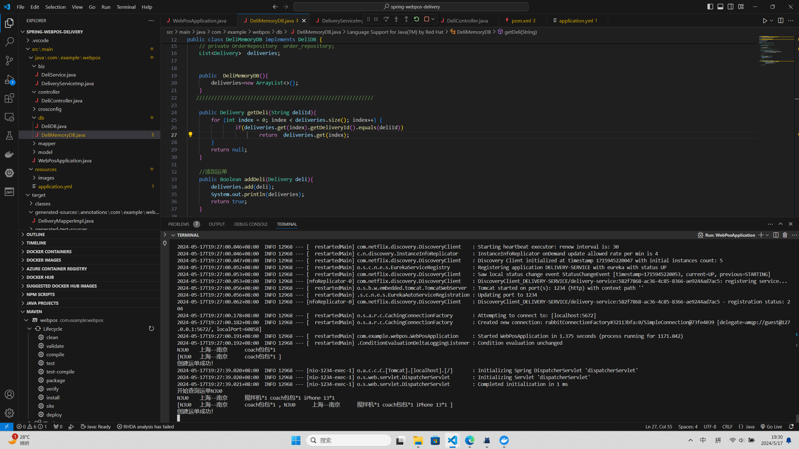

# Message-driven Architecture

------


### 1、效果展示

演示视频：[消息驱动架构rabbitmq_哔哩哔哩_bilibili](https://www.bilibili.com/video/BV1sruHe2EVe/?vd_source=4985f83853fea5fcd090f8f95973265a)

在本次实验中，我使用Docker运行Rabbitmq消息中间件，传递订单节点和运单节点之间的事件，实现架构的松耦合。

------


### 2、关键函数

订单节点发送创建订单的事件：

```java
	//message
    @Autowired
    private RabbitTemplate rabbitTemplate;


    public void createDelivery(String orderId,String describe){
        //准备
        String queueName="delivery.queue";
        Map<String,Object> msg=new HashMap<>(3);
        msg.put("orderId", orderId);
        msg.put("describe", describe);
        
        //发送
        rabbitTemplate.convertAndSend(queueName, msg);
        
        
        System.out.println("发送成功"+String.valueOf(msg));
    }
```


运单节点接受事件：

```java
	//绑定到rabbitmq指定的队列
    @RabbitListener(queues = "delivery.queue")
    public void listen2OrderNode2CreateDeli(Map<String,Object> msg){
        //创建一个新的运单
        String road="上海--南京";
        Delivery deli=new Delivery("NJU"+String.valueOf(number), String.valueOf(msg.get("orderId")), road, String.valueOf(msg.get("describe")));
        number+=1;
        System.err.println(deli);
        deliService.serviceAddDeli(deli);
        System.out.println("创建运单成功！");
    }
```

------


### 3、实验截图

##### 1、微服务架构的eureka连接。




##### 2、cmd打印：order节点成功发送创建运单的事件。




##### 3、cmd打印：delivery节点成功接收创建运单的事件，并创建运单。

