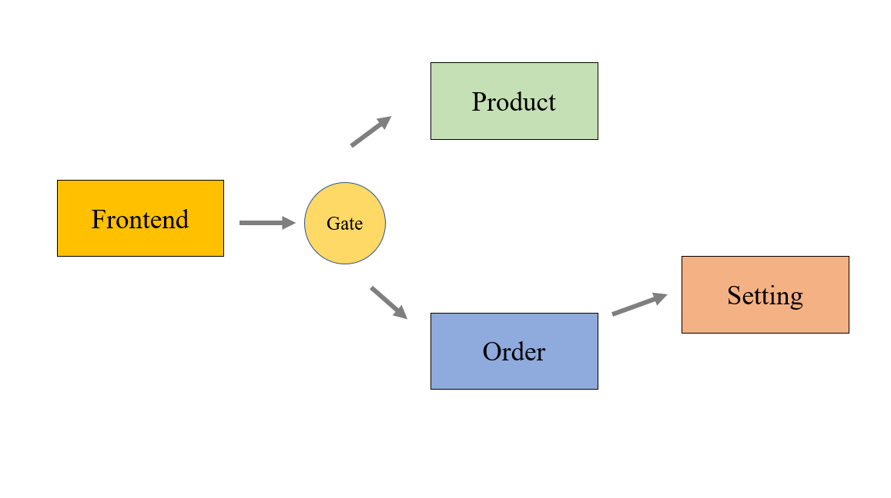
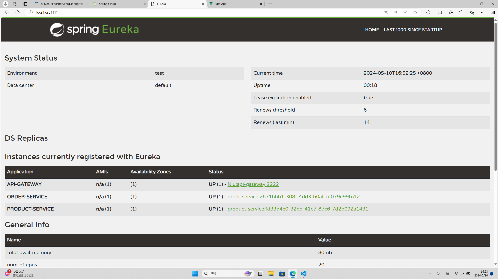

# MicroServices


## 1. 系统架构设计：



------


## 2、实现细节

自己重写了一下前端，并增加了gateway和discovery节点形成微服务架构。目前提供服务的有三个节点，一个管理商品，一个管理订单和一个setting信息的服务节点。购物车则实现在前端。

项目结构：

```python
----
	--api 			                              #restful接口
	--picture		                              #实验图片
    --spring-webpos-api-gateway                   #gateway节点
    --spring-webpos-discovery-server              #ureka节点
    --spring-webpos-order                         #订单服务节点
    --spring-webpos-product                       #产品服务节点
    --useRestTemplate							  #setting服务节点	
    --vue-webpos-frontend                         #前端框架
```


演示视频在这里：https://www.bilibili.com/video/BV11t421u72W/

ureka节点的注册状态：



------


## 3、扩展实验。

下面仅对spring-webpos-product服务节点进行了实验。实验结果如下：

| 节点个数 | Avg(ms) | Min(ms) | Max(ms) | 95%  |
| -------- | ------- | ------- | ------- | ---- |
| 1        | 1647    | 930     | 2558    | 2021 |
| 2        | 282     | 6       | 1072    | 657  |
| 3        | 212     | 4       | 528     | 492  |

微服务可以很容易实现水平向扩展。

------


### 4、断路器和RestTemplate

断路器是现在spring-webpos-product里面；spring-webpos-order里面实现了restTemplate。
