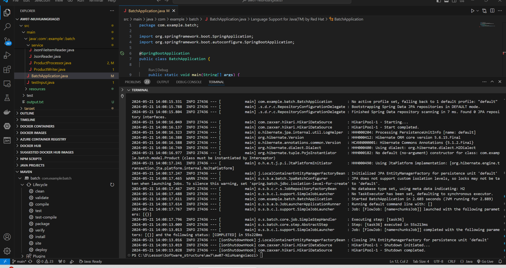
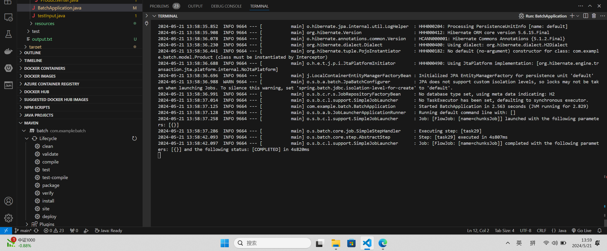
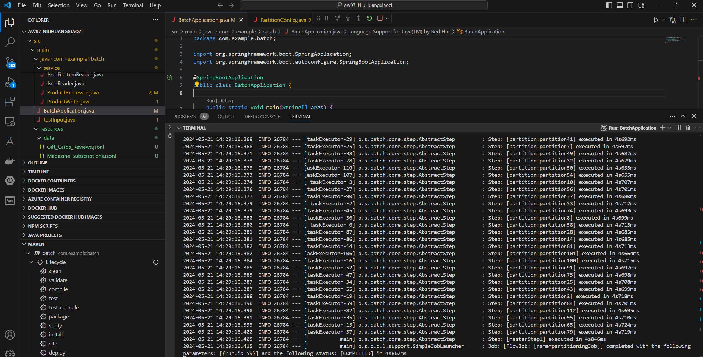

# Pipes-Filters


## 注意:

1. picture文件夹下是实验截图，可选择查看
2. 数据处理性能见1.1，特殊处理和webpos演示视频直接滑倒readme.md底部。
3. 查看review的处理过程查看 https://github.com/sawork-2024/aw07-NiuHuangxiaozi/blob/main/src/main/java/com/example/batch/service/reviewItemProcessor.java
4. 查看product的处理过程查看 https://github.com/sawork-2024/aw07-NiuHuangxiaozi/blob/main/src/main/java/com/example/batch/service/ProductProcessor.java

------


### 1.1 实验结果

我选择的是Gift_Cards_Reviews数据集和Magazine_Subscriptions数据集。但做下面的实验的时候选择了一个大的数据集是meta_All_Beauty。实验结果如下：

| taskExecutor                                        | chunk | 时间     |
| --------------------------------------------------- | ----- | -------- |
| No                                                  | 1     | 55s228ms |
| No                                                  | 10    | 13s113ms |
| No                                                  | 20    | 10s519ms |
| CorePoolSize=2    MaxPoolSize=2  QueueCapacity=10   | 20    | 6s872ms  |
| CorePoolSize=10    MaxPoolSize=10  QueueCapacity=10 | 20    | 4s747ms  |
| CorePoolSize=10    MaxPoolSize=10  QueueCapacity=20 | 20    | 4s851ms  |
| CorePoolSize=10    MaxPoolSize=20  QueueCapacity=20 | 20    | 4s852ms  |
| CorePoolSize=20    MaxPoolSize=20  QueueCapacity=20 | 20    | 4s820ms  |
| Partition划分为113份文件，每一个文件有1000行数据    | 1     | 17s344ms |
| Partition划分为113份文件，每一个文件有1000行数据    | 20    | 4s862ms  |

从表中我们可以得出以下的结论：增加chunk能够加速处理；使用线程池可以加速处理；文件划分并行处理也可以加速处理。


------


### 1.2 关键代码

##### 1.2.1 在读的时候使用默认的objectMapper。

使用objectMapper.readValue将每一行的json对象映射为java对象。

```java
private LineMapper<preProduct> lineMapper() {
        final ObjectMapper objectMapper = new ObjectMapper();
        return (line, lineNumber) -> objectMapper.readValue(line,preProduct.class);
    }
```

##### 1.2.2 写入数据库的ItemWriter

使用sql语句写入，在schema.sql文件中提前把表建好。

```java
@Bean
    public JdbcBatchItemWriter<Product> h2Writer() {
        String sqlcmd="(id, name, price, image, stock, quantity, main_category, average_rating, rating_number, features, store)";
        String inputs="(:id, :name, :price, :image, :stock, :quantity, :main_category, :average_rating, :rating_number, :features, :store)";
        return new JdbcBatchItemWriterBuilder<Product>()
                .itemSqlParameterSourceProvider(new BeanPropertyItemSqlParameterSourceProvider<>())
                .sql("INSERT INTO Pipproduct " + sqlcmd + " VALUES "+ inputs)
                .dataSource(dataSource)
                .build();
    }
```


##### 1.2.3 partitioner的划分

##### 使用"#{stepExecutionContext['fileName']}"来给slaveserver对应文件。

```java
@Bean
public Partitioner partitioner() {
        return gridSize -> {
            Map<String, ExecutionContext> partitionMap = new HashMap<>();
            for (int i = 1; i <= gridSize; i++) {
                ExecutionContext context = new ExecutionContext();
                			     	context.putString("fileName","src/main/resources/meta_All_Beauties/meta_All_Beauty (" + i + ").txt");
                partitionMap.put("partition" + i, context);
            }
            return partitionMap;
        };
    }
```

------


### 1.3 部分实验截图

##### 1.3.1  没有使用taskExecutor并且chunk为1的实验截图




##### 1.3.2  CorePoolSize=20    MaxPoolSize=20  QueueCapacity=20并且chunk为20的实验截图




##### 1.3.3  在partition文件情况下，chunk为20的实验截图




------


## 2、整合进webpos

在视频中一共有magazine和Gift card两个商品，鼠标放到商品上显示详细信息，点击查看相关评论
我所做的相应的处理：
        1、评论的图片显示鸟是因为我做了特殊的处理，如果image为null就显示默认的这张图片。
        2、如果价格为null，我就会默认显示20。
        3、有些商品的商品描述和名称长度太长了，所以我就截取长度在150以内。


效果演示请看：https://www.bilibili.com/video/BV1tvuXenEtj/


