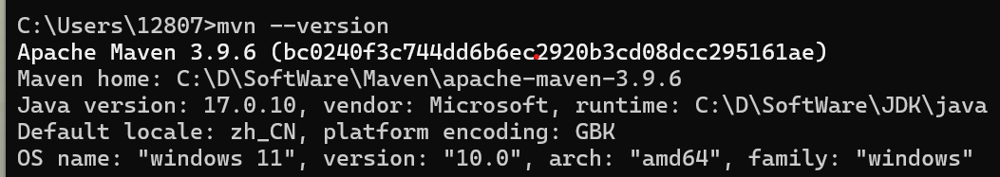

# Software-Structure


# 1. Introduction

​		Here are some initial concepts about software structure. Learn how to design a software architecture to better solve real-world problems and integrate popular algorithms into your program design.

​		These designs will enhance your system's performance and robustness. While this repo may seem basic and even simplistic, it can serve as a great stepping stone for freshmen to complete more complex programs in the future.

​		If you want to learn more, don't forget to subscribe to this channel:     [click here](https://space.bilibili.com/347527982/channel/seriesdetail?sid=408707)

------


# 2. Navigation

1. 💉Ioc  

2. 🗼Layered-Systems

3. 📚MVC

4. 🧩Restful-Structure

5. 💎Scalable-Web-Architecture

6. 🐜MicroServices

7. ✉️Message-Driven

8. 🪈PipesFilters

9. 🔔Reactive

   

   

   ------

   

# 3. Environments

### 3.1  [Java-17](https://www.openlogic.com/openjdk-downloads?field_java_parent_version_target_id=807&field_operating_system_target_id=436&field_architecture_target_id=391&field_java_package_target_id=396)

```shell
openjdk 17.0.10 2024-01-16 LTS
OpenJDK Runtime Environment Microsoft-8902769 (build 17.0.10+7-LTS)
OpenJDK 64-Bit Server VM Microsoft-8902769 (build 17.0.10+7-LTS, mixed mode, sharing)
```

------


### 3.2  [Maven](https://maven.apache.org/download.cgi)



------


### 3.3 Vscode (not necessary)

Some useful plugins:

- Chinese (Simplified)
- Auto Close Tag
- Auto Rename Tag
- Docker
- Maven for Java
- Spring Boot Extension Pack
- Vue 3 Snippets
- MongoDB for VS Code
- Spring Boot Tools

------

### 3.4 [Docker](https://docs.docker.com/desktop/install/windows-install/)

### 3.5 [mongoDB](https://hub.docker.com/_/mongo/) (using Docker image) 


### 3.6 [H2](http://www.h2database.com/html/main.html)

you can also use Docker  image.

### 3.7 [RabbitMQ](https://www.rabbitmq.com/docs/download)

image:


container:


### 3.8 JMETER


### 3.9 Haproxy


### 3.10 [Redis](https://redis.io/downloads/)

Download on Linux system.

------


# 4. Notice

You can refer to this repo, but please do not copy the code directly for your homework submission. Good luck!👿
