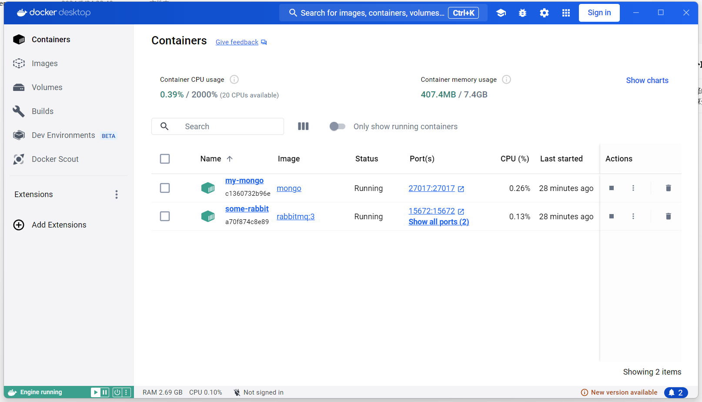
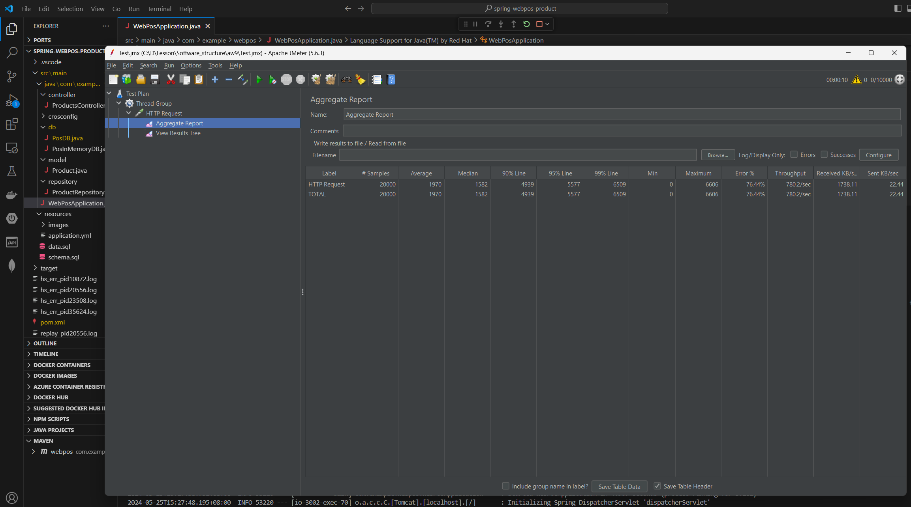

# Reactive


------


### 1、效果展示

演示视频：[基于WebFlux的webpos_哔哩哔哩_bilibili](https://www.bilibili.com/video/BV1kjKDeSEhy/?vd_source=4985f83853fea5fcd090f8f95973265a)

本次实验是将前面的Spring MVC架构替换为SpringWebFlux架构，提高并发处理请求的性能。在实验中使用微服务架构，使用的数据库是基于文档的Mongodb数据库（不能再用关系型数据库），Order节点和Delivery节点之间通过RabbitMQ的delivery.queue的事件队列进行传递。

------


### 2、关键函数举例

下面展示了在spring-webpos-product的PosInMemoryDB.java类中，根据名字查询商品的函数：

```java
@Override
    public Flux<Product> getProductByName(String name){
        
		//多个数据用Flux，单个数据用Mono
        Flux<Product> products=product_repository.findAll();
        
        return products
            	//过滤，找出名字里面含有关键字的商品
                .filter(product -> product.getName().contains(name))
                .collectList()  // Collect the filtered products into a List
                .flatMapMany(Flux::fromIterable);  // Convert the List back to a Flux
    }
```

------


### 3、性能比较

下面的表格是使用JMETER对于/products URL进行的性能检测：

| 设置                | 请求数 | 平均时间 | 中位时间 | 95%  | 99%   | 最小时间 | 最大时间 | 错误率 |
| ------------------- | ------ | -------- | -------- | ---- | ----- | -------- | -------- | ------ |
| 6000MVC             | 6000   | 1148     | 1208     | 2573 | 2762  | 1        | 2788     | 66.72% |
| 6000FLUX            | 6000   | 11       | 10       | 29   | 40    | 4        | 52       | 0.00%  |
| 20000MVC            | 20000  | 1602     | 1740     | 3341 | 3945  | 0        | 4547     | 73.11% |
| 20000FLUX           | 20000  | 2051     | 2085     | 3784 | 4301  | 18       | 5264     | 77.84% |
| 20000MVC+delay50ms  | 20000  | 3597     | 2831     | 9366 | 10554 | 52       | 12828    | 77.46% |
| 20000FLUX+delay50ms | 20000  | 1970     | 1582     | 5577 | 6509  | 0        | 6606     | 76.44% |


从上面的表格中，我们可以得出结论：对于耗时短的后端任务，MVC跟占优势；对于后端耗时长的任务，WebFlux更占优势。说明对于阻塞时间长的任务，优先使用WebFlux技术能够实现能够实现性能提升。

------


### 3、实验截图

##### 3.1  RabbitMQ和MongoDB。




##### 3.2  任务延时50ms，WebFlux架构的性能测试截图



