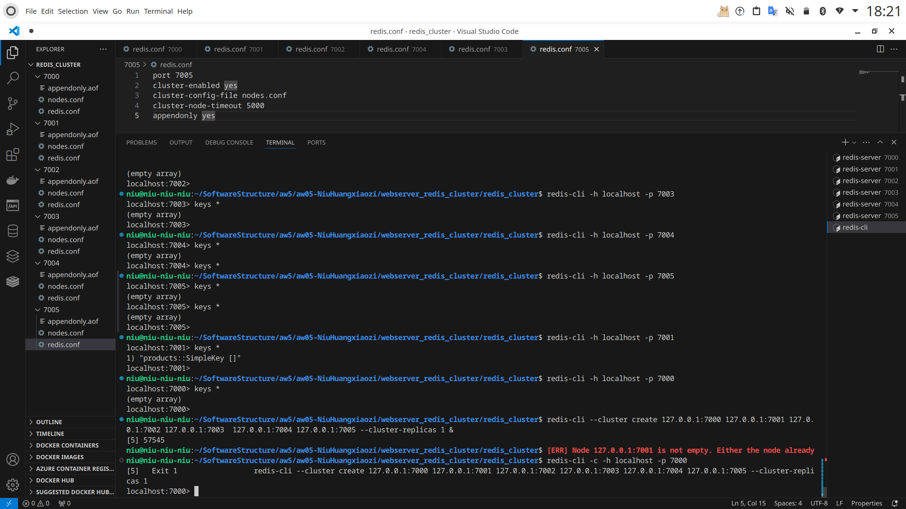

# Scalable Web Architecture


### 1、垂直扩展。

#### 1.0 实验解释。

将db换成京东，（这个很讨厌，每隔一会京东会要求尽心roboot验证，加了cookies也不行，只能手动先通过再进行实验）

下载JMETER和docker，

因为我使用的是h2数据库，所以创建一个docker和相应容器：

[oscarfonts/docker-h2: H2 Dockerfile (github.com)](https://github.com/oscarfonts/docker-h2)

使用下面的命令不断创建不同cpu的容器实验就行了：

```bash
docker run --name=webcontainer_cpu20  -p 3000:3000 --cpus=20  --network backendGroup webbackend
```

#### 1.1 实验结果。

第一个实验是window上写的，使用JMETER作为压力工具，docker控制CPU数目。得到相应的数据表格如下：

| 响应时间(ms) | CPU1 | CPU5 | CPU10 | CPU20 |
| ------------ | ---- | ---- | ----- | ----- |
| Avg          | 1619 | 4    | 5     | 5     |
| Max          | 3527 | 31   | 63    | 60    |
| Min          | 4    | 1    | 2     | 1     |

#### 1.2 实验截图

Docker:


Jmeter:


### 2、水平扩展。

#### 2.1 实验综述

这个实验是参照曹老师的这个视频做的，[软件体系结构-7. 可扩展架构_哔哩哔哩_bilibili](https://www.bilibili.com/video/BV1X7411S7yM/?spm_id_from=333.999.0.0&vd_source=4985f83853fea5fcd090f8f95973265a)

我是使用Jmeter测试工具在Haproxy上进行实验，使用20个线程在1-4个比较弱的服务器上测试。

#### 2.3 实验结果


| server的数量     | 1     | 2     | 3     | 4    |
| ---------------- | ----- | ----- | ----- | ---- |
| 平均响应时间(ms) | 12870 | 11781 | 6899  | 6981 |
| 最小响应时间(ms) | 12284 | 10991 | 4796  | 5788 |
| 最大响应时间(ms) | 13636 | 12748 | 10247 | 7838 |


#### 2.4 实验记录

2.4.1 使用两个server进行测试的Haproxy截图。


2.4.2 使用两个server进行测试的Docker截图，显示有一个h2容器和一个web1服务器。


2.4.3 这是使用Jmeter在一个server情况下的测试结果。


### 3.Cache Missing问题

#### 3.1 实验概况

代码主要在：webserver_redis_cluster文件夹中，backend文件是后端，redis_cluster配置redis集群

实验是按照老师https://www.bilibili.com/video/BV1wR4y1F7Tc/?spm_id_from=333.880.my_history.page.click、[软件体系结构-2022.6-可扩展Web架构-续_哔哩哔哩_bilibili](https://www.bilibili.com/video/BV1p3411s7VZ/?spm_id_from=333.880.my_history.page.click&vd_source=4985f83853fea5fcd090f8f95973265a)和[2. Spring Caching with Redis Cluster_哔哩哔哩_bilibili](https://www.bilibili.com/video/BV17g4y1871A?p=2&vd_source=4985f83853fea5fcd090f8f95973265a)这个系列。

其中卡的最久的问题是：springboot redis集群的配置，当时springboot只能连上6379端口的redis，不管设置port是多少。最后发现是没看最新的官方文档

```
spring.cache.type=redis
spring.data.redis.host=localhost
spring.data.redis.port=7000
#曹老师视频里下面两个都没加data
```

一个小的视频演示：https://www.bilibili.com/video/BV1sT421X7Lg/

#### 3.1 小实验

| redis集群数量 | 1    | 4    |
| ------------- | ---- | ---- |
| Avg(ms)       | 545  | 679  |
| min(ms)       | 3    | 4    |
| max(ms)       | 5820 | 2736 |

4个redis时候感觉能够避免有过长的请求时间。

#### 3.2 实验过程。

这个是按视频配的内置redis集群：


自己创建的集群，7002存了键值：


haproxy转发加上redis集群：


我自己创建的集群：



